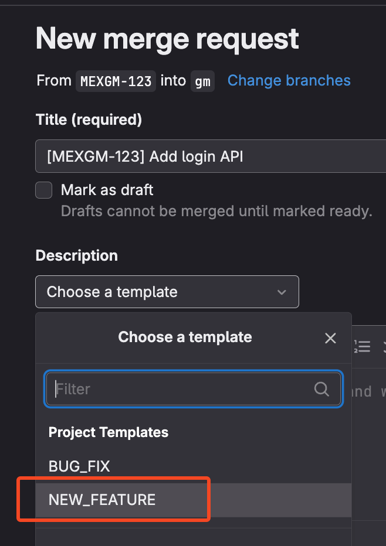

# Merge/Pull Request Guidelines
Please check the following guidelines below `before submitting/reviewing` a Merge/Pull Request in the repository. This guideline is based on Sprobe's official [Merge Request Guidelines](https://portal.sprobe.ph/en/codingstandards/merge-request-guidelines).

More information and insights: [Merge Request: Best Practices](https://www.metridev.com/metrics/merge-request-best-practices-for-code-integration/)

## For Developers
1. Have a clear understanding of the **Task** and set the expectations on how and what it should do before you start to code.   
    [ ] Is there anything you are not sure about? Just ask.

2. Ask the team lead/project manager/SA for the source/starting branch or tag e.g `master` or `develop` where you will branch out `git checkout -b new-branch-name` for your new task.   
    [ ] Ask for the branch name convention e.g `feature-####`, `bug-fix-####`.  
    [ ] In your project repo, set a default branch (e.g. `dev` branch). This will be the branch where ALL new tasks will branch out.

3. Follow the branch naming convention, e.g. `feature-[BACKLOG-TICKET-KEY]` or `bug-fix-[BACKLOG-TICKET-KEY]`.
    ```
    feature-MEXGM-21
    ```

    ```
    bug-fix-MEXGM-23
    ```

4. Does the system have existing automated testing?    
    [ ] If `YES`, run the **whole test suite** `FIRST` and make sure there are `NO ERRORS/FAILURES` in any of the tests.    
    [ ] If there are errors, **inform the Team Lead or Project Manager** regarding the errors before proceeding in implementing your code.

5. Write Unit Tests **first**. Make sure you write happy path and exception tests.  
    [ ] Run your Unit\Feature Tests and make sure all the cases are `PASSING`.     
    [ ] Run the Whole Test Suite and make sure there are no `FAILING` tests from other tests files.   
    [ ] If any other tests FAILS, check if the logic has been affected by your recent file changes.     

6. Begin writing your code and implement the feature.

7. Self Review your Code:

    <strong style="font-size: 14px">COMMON</strong>
    - 

    [ ] Are there any typo errors?  
    [ ] Did you remove everything that is not supposed to be there?     
&nbsp;&nbsp;&nbsp;&nbsp;&nbsp;[ ] Debug prints/logs?    
&nbsp;&nbsp;&nbsp;&nbsp;&nbsp;[ ] Unnecessary trailing spaces or extra empty lines?     
    [ ] Does it do what it is supposed to do?   
    [ ] Did you check all the possible edge cases and have a solution for them?     
    [ ] Is the code easy to read and understand?    
&nbsp;&nbsp;&nbsp;&nbsp;&nbsp;[ ] Did you choose the best names and organise things as cleanly as possible?      
    [ ] Isn't the functionality you've added already implemented somewhere else?    
&nbsp;&nbsp;&nbsp;&nbsp;&nbsp;[ ] If it's duplicated, reconsider the design.     
    [ ] Isn't there any conceivable way this could break other parts of the system?     
    [ ] Aren't there any possible security threats?     

    <strong style="font-size: 14px">FRONTEND</strong>
    - 
    
    [ ] Make sure to `ASK` for the `Adobe XD/Figma Design` or any `Mockup` available for your task  
    [ ] Did you use any existing UI components?     
    [ ] Is the UI visually consistent? (font size, line height, margin, padding, etc.)    
    [ ] Did you perform any Error Validations?   
    [ ] Does it look OK on phone/mobile/tablet?     
    [ ] Are the elements fluid/mobile responsive and does not break or look weird on **smaller devices/screen sizes**?     
    [ ] How is the text content? Are sentences well-formed and clear? Any spelling error or typos?  
    [ ] Can your code handle the scenario when the request to the backend API fails?    
    [ ] Did you make any changes to any existing component in the UI?   
&nbsp;&nbsp;&nbsp;&nbsp;&nbsp;[ ] If so, make sure to check if all usages of the component still work as expected.    
    [ ] Check if there are **no errors in the browser's developer console**.    
    [ ] Make sure there are NO WARN/ERR in ESLint. **AVOID** pushing code with **Errors and Warnings** in ESLint.    

    <strong style="font-size: 14px">BACKEND</strong>
    - 
 
    [ ] Did you perform any Error Validations?   
    [ ] Does your code follows the PSR12 Coding Standards?      
&nbsp;&nbsp;&nbsp;&nbsp;&nbsp;[ ] Make sure to follow the <a href="https://www.php-fig.org/psr/psr-12/">**PSR12 Coding Standards**</a> for your backend code.   
    [ ] Run `./fixer` in your local to apply Fix/Format your PHP Code to follow the PSR12 Standards.    

8. Commit your changes if all tests (Automated Unit Testing and Selenium) are `PASSING`. 

9. Make sure to use <u>**PRESENT TENSE**</u> (in [sentence case](https://writer.com/blog/sentence-case/#:~:text=When%20you%20use%20sentence%20case,you%20would%20a%20regular%20sentence.)) approach when creating your Git commit messages.  
    [ ] The preference for present-tense, imperative-style commit messages comes from [**Git Documentation/SubmittingPatches**](https://git.kernel.org/pub/scm/git/git.git/tree/Documentation/SubmittingPatches?h=v2.36.1#n181) in the Git repo itself.

    ```
    git commit -m "Add error message when username is blank"
    ```

    

10. Perform fetch from the source branch defined above. Please <b>**AVOID**</b> using `git pull`.

    ```
    git fetch dev 
    ```

11. Merge your current branch with the changes from source branch before pushing your changes.

    ```
    git merge origin/dev
    ```
    ```
    git push origin feature-MEXGM-21
    ```

    > **Note**: We recommend to use **MERGE** instead of **REBASE** to simply avoid confusion for now. Merge logs show you the complete history of commit merging. Rebase logs are linear. 

    [ ] If there are conflicts, please **fix them carefully**.  
    [ ] After fixing conflicts, run the whole Test Suite again (Automated Unit Test & Selenium if applicable) and make sure everything is `PASSING`.  
    [ ] Manually check, review, and test the UI of your implementation.  

12. Submit/Create the Merge Request. Make sure to provide the following information:   
    [ ] Check and change the **Source branch** name into your current feature branch and **Target branch** should be `dev`.  
    [ ] Descriptive Merge Request **Title** using <u>**PRESENT TENSE**</u> (in [sentence case](https://writer.com/blog/sentence-case/#:~:text=When%20you%20use%20sentence%20case,you%20would%20a%20regular%20sentence.)) approach (as mentioned above) using the following template: 
    
    ```    
    [BACKLOG-TICKET-KEY] Present tense title describing the merge request
    ```
    Example:
    ```    
    [MEXGM-123] Add login API
    ```
    [ ] Or simply use the descriptive task title from Backlog. Do not forget to add the `[BACKLOG-TICKET-KEY]`.

    [ ] Select and use the `NEW_FEATURE` template (or the `BUG_FIX` template for bug fixing) in the Description dropdown to auto-populate your MR body with sections. Update the description body accordingly. Instructions and examples are already provided in each of the templates.    
&nbsp;&nbsp;&nbsp;&nbsp;&nbsp;[ ] Please **AVOID** removing sections that are NOT optional. Supply enough details as much as possible or simply put **N/A** if not applicable.

    

---

## For Reviewers

1. Code Review  
    [ ] Check the reference for UI **Mockup/XD/Figma Design**. Be Strict in reviewing the design e.g alignment, color, formatting (pixel perfect if necessary).     
    [ ] Visual checking by following the **Test Plan / Steps to Execute** and make sure the **Acceptance Criteria** is fulfilled.    
    [ ] Make sure to check the UI in different **Screen Sizes**. The elements in the page should be fluid/mobile responsive and does not break/act weird on **smaller devices/screen sizes**.   
    [ ] Run the whole Test Suite, both **Automated Unit Test and Selenium** if available.   
&nbsp;&nbsp;&nbsp;&nbsp;&nbsp;[ ] If there are errors, **NOTIFY** the developer and **DO NOT** proceed with the code review unless all Test Suites are `PASSING`.   
    [ ] Do not hesitate to submit `Request Changes` to the developer if you found something after reviewing like any and not limited to the following:   
&nbsp;&nbsp;&nbsp;&nbsp;&nbsp;[ ] Errors in the browser's developer console   
&nbsp;&nbsp;&nbsp;&nbsp;&nbsp;[ ] Errors while running PHPUnit and Selenium tests      
&nbsp;&nbsp;&nbsp;&nbsp;&nbsp;[ ] ESLint warning and error messages     
&nbsp;&nbsp;&nbsp;&nbsp;&nbsp;[ ] Design Pattern Standards (Error/Exception Handling, Coding Structure, etc) are not being followed     
&nbsp;&nbsp;&nbsp;&nbsp;&nbsp;[ ] Acceptance Criteria is not fulfilled      
&nbsp;&nbsp;&nbsp;&nbsp;&nbsp;[ ] Unexpected errors/issues while running the task 

2. `Approve/Accept` the Merge Request.
3. Merge the MR ONLY IF you are the **final reviewer**.
4. Reviewer has the right to fail or not accept the Merge Request, and give feedback/request for changes if developer fail to follow the above requirements.
